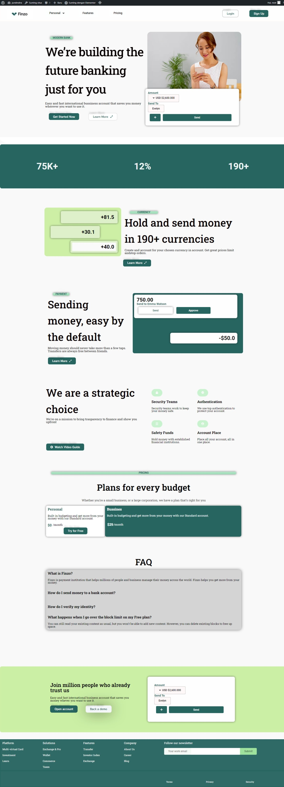
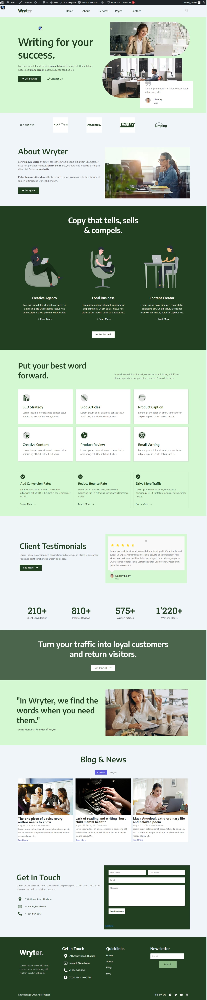
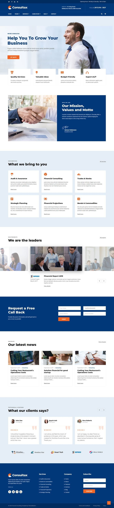
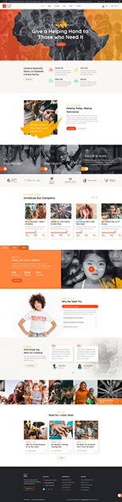

# Magang WordPress
Deskripsi: apa yang saya kerjakan selama magang.

- Mengembangkan dan mendesain website menggunakan platform WordPress, dengan fokus pada pembuatan landing page dan website penuh.
- Melakukan latihan awal dalam membuat landing page berdasarkan desain contoh yang diberikan.
- Berkontribusi dalam pembuatan website donasi, memastikan fungsionalitas dan tampilan sesuai dengan kebutuhan. Serta integrasi dengan sistem pembayaran Tripay.
- Mengelola dan mengoptimalkan elemen-elemen website, termasuk layout, konten, dan navigasi, agar website mudah diakses dan responsif.

## Screenshot

### Landing Page
- Membuat landing page berdasarkan contoh yang diberikan.

#### Landing Page 1

#### Landing Page 2

#### Landing Page 3

### Website Donasi
- Membuat website donasi yang terintegrasi dengan sistem  pembayaran Tripay.

